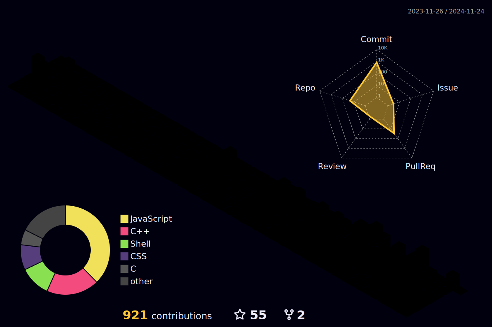

    

    

<!-- Recent Projects -->

## 📌 Recent Projects  

|        |         |
| :----: | :-----: |
|  |                          |
|          |  |

<!-- Skills & Leetcode -->

<table>
    <tr>
        <td width="50%" valign="top">
            <h2 align="center"> 💻 My Skills </h2>
                <h3>- Programming Languages</h3>
                    
                    
                    
                    
                    
                    
                    
                    
                    
                    
                    
                <h3>- Frameworks & Libraries</h3>
                    
                    
                    
                    
                    
                <h3>- Database & Cloud Hosting</h3>
                    
                    
                <h3>- Software & Tools</h3>
                    
                    
                    
                    
        </td>
        <td width="50%" valign="top">
            <h2 align="center"> 🏆 LeetCode Achievements </h2>
            

                
                

                    
                    
                

            

            <h2 align="center"> 🎵 Currently Listening 🎵 </h2>
            

                
            

        </td>
    </tr>
</table>

<!-- Github Stats -->

##   GitHub Stats

|  |  |
| --- | --- |

|  |
| --- |

<table>
    <tr>
        <td width="60%" valign="top">
            
        </td>
        <td width="30%" valign="center">
            
            
        </td>
    </tr>
</table>

|  |
| --- |

<!-- Social Network -->

## 🌐 Connect with Me

 
 
 
 

    

